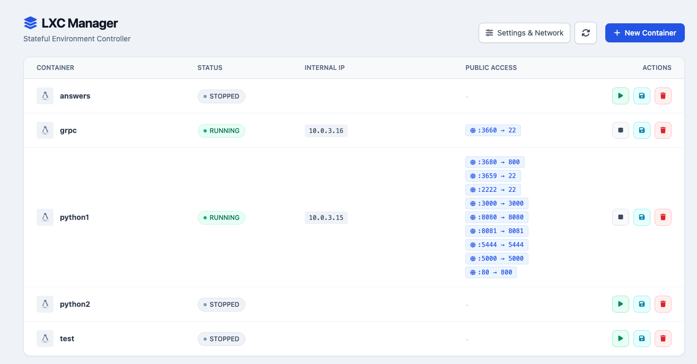
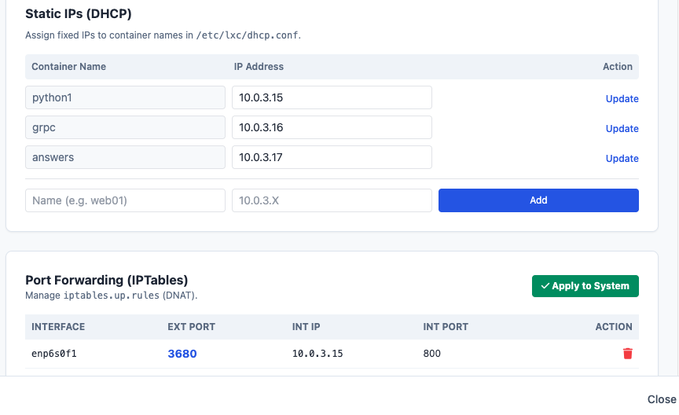

# LXC Simple Manager

A lightweight web interface for managing Linux Containers (LXC) on Debian/Ubuntu servers. It provides a safe, modern UI to manage container lifecycles, network rules, and backups without needing complex orchestration tools like Kubernetes or Proxmox.

It is intended to manage independent software development environments, not production-like processes.



## Features

### Container Management
* **Lifecycle Control:** Start, Stop, Freeze, and Delete containers.
* **One-Click Creation:** Download and deploy generic Linux distro images (Debian, Ubuntu, Alpine).

### Network Orchestrator
* **Port Forwarding (DNAT):** Visual manager for iptables.
* **Safe Architecture:** Uses a custom sidecar chain (`LXC_MANAGER`) to avoid interfering with system-level rules.
* **Static IPs:** Manage DHCP leases for containers directly from the UI.

### Backup & Persistence
* **Container Snapshots:** One-click backup of entire containers to a secondary disk (HDD/SSD).
* **Stateful Config:** All settings and rules are stored in a local SQLite database (`lxc_manager.db`).
* **Config Safety:** Automatically backs up `/etc/iptables.up.rules` and DHCP configs before applying changes.



## Architecture

* **Backend:** Python (FastAPI) + SQLite (SQLModel)
* **Frontend:** Vue.js 3 + Tailwind CSS (Single HTML file)
* **System Integration:**
    * Direct `lxc-*` command execution via Python bindings.
    * Direct `iptables` chain management.
    * Systemd integration for network persistence.

## Installation

### Prerequisites
The manager requires `python3-lxc` and `lxc-net` system packages.

```bash
sudo apt install python3-lxc lxc lxc-net bridge-utils
```

### Automatic Install (Recommended)
This will install the application to `/opt/lxc_manager` and configure it as a systemd service.

```bash
git clone https://github.com/joseprupi/lxc_manager
cd lxc-simple-manager
sudo ./install.sh
```

### Manual Setup (Development)

Create a virtual environment with access to system packages (crucial for `python3-lxc`).
```bash
python3 -m venv venv --system-site-packages
./venv/bin/pip install -r backend/requirements.txt
```

## Usage

If installed via the script, the service runs automatically in the background.

* **Web Interface:** `http://<SERVER_IP>:8001`
* **API Docs:** `http://<SERVER_IP>:8001/docs`
* **Service Status:** `systemctl status lxc-manager`

To run manually for development:

```bash
sudo ./run.sh
```

## Security Note

This tool runs as **root** and exposes system-level controls.

* **Do not expose this port to the public internet.**
* Run only inside a trusted LAN or behind a VPN (Tailscale/Wireguard).
